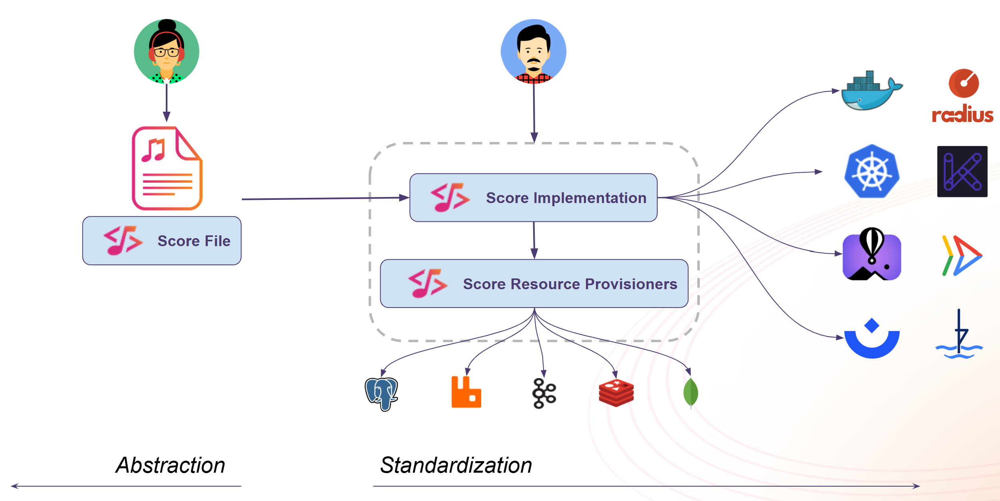

# Introduction

👋 Welcome to the **Score Labspace** lab! During this lab, you will learn to do the following:

- Introduction to Score
- Getting started with `score-compose`
- Getting started with `score-k8s`
- Advanced scenario with `score-compose`
- Advanced scenario with `score-k8s`

## What is Score?

Score is an open-source and a [CNCF Sandbox project](https://www.cncf.io/projects/score/).

Score aims to reduce developer toil and cognitive load by enabling the definition of a single file that works across multiple platforms in a vendor-neutral way, eliminating the need for tooling-specific syntax from platforms such as Docker or Kubernetes for example.

On one hand ("**Abstraction**"), the Score spec allows **Developers** to define how they want to deploy their Workloads. And on the other hand ("**Standardization**"), **Platform Engineers** define well supported golden paths by using Score implementations supported for their platform(s) with associated resource provisioners.

