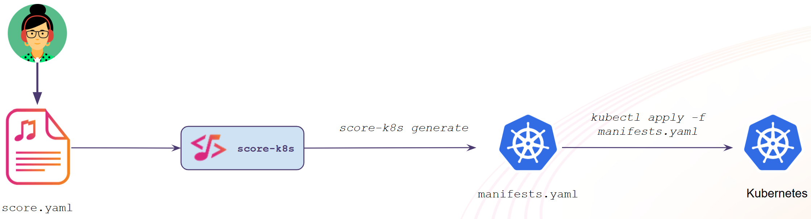

# Getting started with `score-k8s`

From this exact same `score.yaml` file we now want to deploy it to Kubernetes.

Let's do it!

We'll use the `score-k8s` implementation for that.



```bash
score-k8s init
```

```bash
score-k8s generate score.yaml \
    --image scorespec/sample-score-app:latest
```

A new `manifests.yaml` file has been generated, see :fileLink[here]{path="manifests.yaml"}.

All of this technical details abstracted by the `score-k8s` implementation from the Developer.

We can now deploy these Kubernetes manifests to spin up our workload and its dependencies in Kubernetes cluster:
```bash
sudo kubectl apply -f manifests.yaml
```

```bash
sudo kubectl get all,statefulset,secret,httproute
```

Let's test the deployed workload on :tabLink[localhost:8080]{href="http://localhost:8080" title="Web app"}.

At this stage, the we used two resource types: `postgres`, `dns` and `route`.

The available resource types and their inputs/outputs could be discovered like this:
```bash
score-k8s provisioners list
```

We'll explore more about these resource provisioners later.

## Resources

- [`score-k8s` implementation](https://docs.score.dev/docs/score-implementation/score-k8s/)